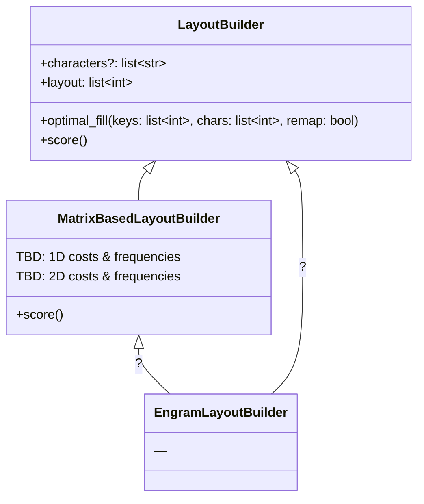
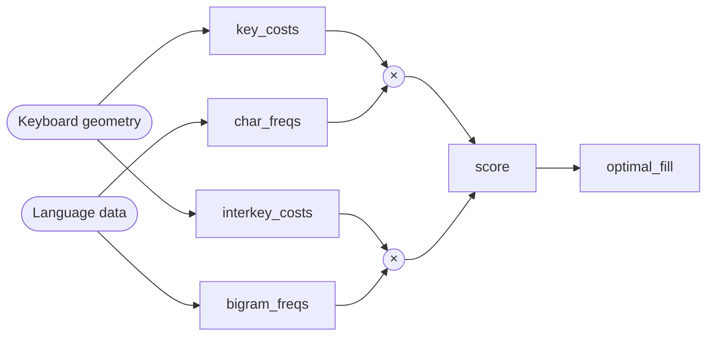
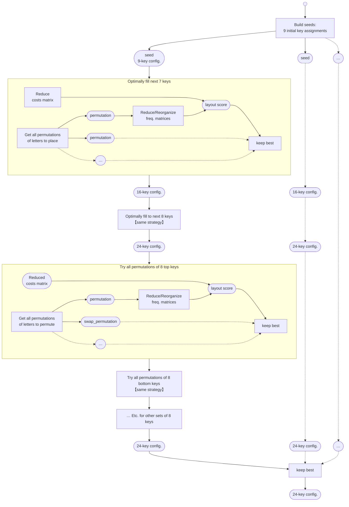

# Re: Speed

## Matrix indexation

Because the algorithm compute scores for all possible permutations of typically 8 characters at a type, it is crucial to make the scoring method as fast as possible.

When it relies on key and/or inter-key costs matrices and character and/or bigrams frequency matrices, the way the elements of those matrices are selected and organized have a significant impact on the matrix speed.

A speed analysis of different relevant operations gave the following results:

<table>
  <tr>
    <th>Executing</th><th colspan="3">Execution in ms, for 1,000,000 executions (ratio with <code>m[i, :][:, i]</code> with <code>i: slice</code>)</th>
  </tr>
  <tr>
    <th></th><th colspan="3">Extracting a <em>n</em>×<em>n</em> matrix from a 26×26 matrix</th>
  </tr>
  <tr>
    <th></th>
    <th>n = 8</th>
    <th>n = 16</th>
    <th>n = 24</th>
  </tr>
  <tr>
    <td><code>m[:n, :][:, :n]</code> with <code>n: int</code></td>
    <td>532,664.4 (1.11)</td>
    <td>494,158.9 (1.01)</td>
    <td>545,290.8 (1.21)</td>
  </tr>
  <tr>
    <td><code>m[i, :][:, i]</code> with <code>i: slice</code></td>
    <td>479,421.4 (1.00)</td>
    <td>491,483.7 (1.00)</td>
    <td>449,772.4 (1.00)</td>
  </tr>
  <tr>
    <td><code>m[i, :][:, i]</code> with <code>i: list[int]</code></td>
    <td>5,431,880.5 (11.33)</td>
    <td>6,300,507.7 (12.82)</td>
    <td>7,522,178.6 (16.72)</td>
  </tr>
  <tr>
    <td><code>m[i, :][:, i]</code> with <code>i: tuple[int]</code></td>
    <td>5,422,201.1 (11.31)</td>
    <td>6,293,001.8 (12.80)</td>
    <td>7,529,484.9 (16.74)</td>
  </tr>
  <tr>
    <td><code>m[i, :][:, i]</code> with <code>i: NpVector[int]</code></td>
    <td>3,151,059.9 (6.57)</td>
    <td>3,383,072.0 (6.88)</td>
    <td>3,772,552.5 (8.39)</td>
  </tr>
  <tr class="hl-row">
    <td><code>m[i, :][:, i]</code> with <code>i: tuple[int]</code> first converted into a <code>NpVector[int]</code></td>
    <td>4,058,703.0 (8.47)</td>
    <td>4,639,294.9 (9.44)</td>
    <td>5,522,499.7 (12.28)</td>
  </tr>
  <tr>
    <td><code>m[i, :][:, i]</code> with <code>i: list[bool]</code></td>
    <td>7,994,003.5 (16.67)</td>
    <td>8,195,971.4 (16.68)</td>
    <td>8,689,734.3 (19.32)</td>
  </tr>
  <tr>
    <td><code>m[i, :][:, i]</code> with <code>i: NpVector[bool]</code></td>
    <td>3,754,292.5 (7.83)</td>
    <td>4,010,179.7 (8.16)</td>
    <td>4,461,887.2 (9.92)</td>
  </tr>
  <tr>
    <th></th><th colspan="3">Operating on a (potentially flattened) <em>n</em>×<em>n</em> matrix</th>
  </tr>
  <tr>
    <td><code>m[i]</code> with <code>i: NpArray2D[bool]</code></td>
    <td>996,559.8 (2.08)</td>
    <td>1,117,124.2 (2.27)</td>
    <td>1,405,432.7 (3.12)</td>
  </tr>
  <tr>
    <td><code>m * M</code> with <code>m,M: NpVector[float]</code></td>
    <td>533,778.2 (1.11)</td>
    <td>653,493.2 (1.33)</td>
    <td>861,469.7 (1.92)</td>
  </tr>
  <tr>
    <td><code>m * M</code> with <code>m,M: NpArray2D[float]</code></td>
    <td>1,422,829.9 (2.97)</td>
    <td>1,528,080.6 (3.11)</td>
    <td>1,982,989.0 (4.41)</td>
  </tr>
  <tr>
    <td><code>np.sum(m)</code> with <code>m: NpVector[float]</code></td>
    <td>3,003,102.1 (6.26)</td>
    <td>2,904,138.7 (5.91)</td>
    <td>3,319,026.7 (7.38)</td>
  </tr>
  <tr>
    <td><code>np.sum(m)</code> with <code>m: NpArray2D[float]</code></td>
    <td>3,418,851.0 (7.13)</td>
    <td>3,359,068.9 (6.83)</td>
    <td>4,052,232.4 (9.01)</td>
  </tr>
  <tr>
    <td><code>np.flatten(m)</code> with <code>m: NpArray2D[float]</code></td>
    <td>754,380.2 (1.57)</td>
    <td>934,838.6 (1.90)</td>
    <td>1,025,737.8 (2.28)</td>
  </tr>
  <tr class="hl-row">
    <td><code>np.sum( m * M )</code> with <code>m,M: NpArray2D[float]</code></td>
    <td>4,880,553.1 (10.18)</td>
    <td>5,110,640.0 (10.40)</td>
    <td>5,924,203.2 (13.17)</td>
  </tr>
  <tr>
    <td><code>np.sum( m.flatten() * M.flatten() )</code></td>
    <td>5,331,785.6 (11.12)</td>
    <td>5,882,346.8 (11.97)</td>
    <td>6,681,192.5 (14.85)</td>
  </tr>
  <tr>
    <td>Swap 2 indices in a <code>NpArray2D[float]</code></td>
    <td>5,889,532.4 (12.28)</td>
    <td>5,671,862.1 (11.54)</td>
    <td>5,738,822.9 (12.76)</td>
  </tr>
  <tr>
    <th></th><th colspan="3">Operating on a set of <em>n</em> indices</th>
  </tr>
  <tr>
    <td>Convert a <code>list[int]</code> into a <code>Vector[int]</code></td>
    <td>743,051.6 (1.55)</td>
    <td>1,053,442.2 (2.14)</td>
    <td>1,466,881.7 (3.26)</td>
  </tr>
  <tr>
    <td>Swap 2 indices in a <code>Vector[int]</code></td>
    <td>1,689,294.4 (3.52)</td>
    <td>1,630,977.9 (3.32)</td>
    <td>1,588,691.8 (3.53)</td>
  </tr>
</table>

The fastest way to extract part of a matrix is to use slices (ideally reusing a precomputed `slice` object). However, this does not allow to reorganize the order of the column, which is necessary when trying permutations of characters for a given set of keys.
While one could consider to extract the matrix with the relevant rows and columns, then go through all permutations by swapping 1 row and 1 column between each case[^swap-permutation], swapping rows and columns in such a matrix proved to be slower than just using indices.

[^swap-permutation]: It is indeed possible to reach all permutation on a set of elements by operating a single swap of two of its element between each permutation.

When using indices, using Numpy vectors for the latter rather than lists or tuples proved to be faster, to a point where it is beneficial to convert a list of indices into a `np.array` before addressing a matrix with it.

Regarding the operations on the reduced matrices: while operations on vectors (1D) are faster, it is slower to flatten the matrices before the operations than to directly work with the 2D matrices.

## Miscellaneous

- To add a 3rd dimension to a 2D matrix `m`, `m[:,:,np.newaxis]` proved to about 3 times faster than `np.atleast_3d(m)`.
- To append values given in a tuple `right: tuple[int, ...]` to a list `left: list[int]`, simply using `left + list(right)` is about 2 times faster than `list(itertools.chain(left, right))`.

---

# Structure

- Support different scoring strategies, different layouts, different alphabets
	- `.score()` is implemented by a subclass
	- layout data is fed to or built by implementation subclass
	- alphabet is fed (top class)
- Optimal fill = top class

Fundamentally, `LayoutBuilder` and `MatrixBasedLayoutBuilder` don't need the list of characters. And the number of characters and keys do not need to match — and so the cost matrices and frequency matrices don't need to have matching sizes. However, all cost matrices must have matching size. Same for frequency matrices.

## `MatrixBasedLayoutBuilder`

> [!TIP]
> *Why the possibility to have different bigram frequencies?*
> 
> Let say you want to integrate to the scoring the times where letters are typed after each other but separated by a space (for example *o*→*b* when typing “foo bar”). Those “skip-grams” would come with their specific costs/scores, but also their specific frequencies.

Why flexibility? 

# Scoring a layout

## General strategies

### Scoring based on key costs and interkey costs

$\newcommand{\Keys  }{\mathcal{K}}$           <!-- Set of keys -->
$\newcommand{\Chars }{\mathcal{C}}$           <!-- Set of chars -->
$\newcommand{\aKeys }{\mathcal{K^{\circ}}}$   <!-- Set of assigned keys -->
$\newcommand{\aChars}{\mathcal{C^{\circ}}}$   <!-- Set of assigned chars -->
$\newcommand{\uKeys }{\mathcal{K^{\times}}}$  <!-- Set of unassigned keys -->
$\newcommand{\uChars}{\mathcal{C^{\times}}}$  <!-- Set of unassigned chars -->
$\newcommand{\Score}{\mathcal{S}}$            <!-- Score -->
$\newcommand{\card}[1]{\left|{#1}\right|}$    <!-- Number of elements of a set -->
$\newcommand{\eqdef}{\coloneqq}$              <!-- Definitional equality -->

A layout is described thusly:
- To each **key**, an index $k\in\Keys$ is assigned and will be used to identify the key.
- To each **character**, an index $i\in\Chars$ is assigned and will be used to identify the character.
- A **layout** (full or partial) is defined as an assignment of characters to keys, $k\mapsto i_k$, on a subset of keys $\aKeys$ ($\aKeys\sub\Keys$). The assigned characters are noted $\aChars\eqdef\left\{i_k|k\in\aKeys\right\}\sub\Chars$. The unassigned keys and characters are respectively noted $\uKeys\eqdef\Keys\backslash\aKeys$ and $\uChars\eqdef\Chars\backslash\aChars$.

> [!IMPORTANT]
> - Keys: $k\in\Keys$
> - Characters: $i\in\Chars$
> - Layout: $\left(\begin{aligned}\aKeys&\rightarrow\aChars\\k&\mapsto i_k\end{aligned}\right)$ with: $\left\{\begin{aligned}\aKeys&\sub\Keys\\\aChars&\sub\Chars\end{aligned}\right.$ and: $\left\{\begin{aligned}\uKeys &\eqdef \Keys\backslash\aKeys\\\uChars &\eqdef \Chars\backslash\aChars\end{aligned}\right.$

To describe the efficiency of a layout, we use key costs and interkey costs.
- **Key costs:** To each key $k\in\Keys$ is associated a cost $c_k$ describing how costly using this key is in a given situation[^key-situation]. For each character $i\in\Chars$, the frequency $f_i$ describes how often the character is met in this situation. The total score associated to a full layout can then be: $$\Score\eqdef\sum_{k\in\Keys}{c_k\cdot f_{i_k}}$$
- **Interkey costs:** To each pair of key $(k,h)\in\Keys^2$ is associated a cost $c_{k,h}$ describing how costly using this pair of keys is in a given situation[^interkey-situation]. For each pair of characters $(i,j)\in\Chars^2$, the frequency $f_{i,j}$ describes how often the pair is met in this situation. The total score associated to a full layout can then be: $$\Score\eqdef\sum_{k,h\in\Keys^2}{c_{k,h}\cdot f_{i_k,i_h}}$$
- **Combining costs**: Of course, different types of key and interkey costs, with their associated frequencies, can be combined through a simple addition. For simplicity sake, further discussion will consider only a single cost at a time, but he results apply for combined costs through addition.

[^key-situation]: Typically, the situation is “any time”. The $c_k$'s are then a general measurement of how tiresome each key is, while the $f_i$'s are the frequencies of each character in general.

[^interkey-situation]: Typically, the situation is typing one key right after the other. The $c_{k,h}$'s are then a general measurement of how tiresome each succession of two keys is, while the $f_{i,j}$'s are the frequencies of each bigram in general. Another situation of interest can be “skip-grams”, i.e. when a succession of keys $k$, \*, $h$ is typed, where \* is any other key. 

### “Restricted scoring”: Scoring sub-layouts by ignoring the unknown

The most basic way to score a sub-layout is to simply score based the assigned keys only:
- For **key costs**: $$\Score\eqdef\sum_{k\in\aKeys}{c_k\cdot f_{i_k}}$$
- For **interkey costs**: $$\Score\eqdef\sum_{k,h\in\aKeys^2}{c_{k,h}\cdot f_{i_k,i_h}}$$

We will call that *“restrictive scoring”*.

### “Anticipative scoring”: Scoring sub-layouts by averaging the unknown

An alternative way of scoring a sub-layout is to take an average of the resulting scores for all possible assignment for the unassigned keys. The reader might be familiar with Schrödinger's cat: a cat in a box has as much chance of ending up dead as alive; and as long as we don't know its actual state, we treat it as simultaneously 50% dead and 50% alive. Similarly, we can view every unassigned key as being simultaneously assigned to all unassigned letters. We will call that *“anticipative scoring”*.

Then, in the case if a single set of **key costs**, the score for the sub-layout is:
$$\Score = \sum_{k\in\aKeys}{c_k\cdot f_{i_k}} + \sum_{k\in\uKeys}{c_k\cdot \left(\frac{1}{\card{\uChars}}\sum_{i\in\uChars} f_{i}\right)} $$
We observe that:
$$\Score = \sum_{k\in\aKeys}{c_k\cdot f_{i_k}} + \Score_0^×$$
where $\Score_0^×$ is a constant depending only on the sets of unassigned keys and letters $\uKeys$ and $\uChars$. When selecting between sub-layouts wit6h the same sets off assigned keys and letters, for example because we try all permutations of a given set of letters onto a given set of keys, $\Score_0^×$ can be ignored: using anticipative scoring would result in the same sub-layout selection of as restricted scoring.

However, for **interkey costs**, the score $s_{k,h}$ associated to each pair of keys $(k,h)\in\Keys$ is given by[^skh]:
$$\left\{\begin{align}
\hspace{1em}&\mathrm{if\ \ }k\in\aKeys, h\in\aKeys:&\hspace{1em}& s_{k,h} = c_{k,h}\cdot f_{i_k,i_h}&\hspace{3em}\\
&\mathrm{if\ \ }k\in\aKeys, h\in\uKeys:&& s_{k,h} = \frac{1}{\card{\uChars}} \sum_{j\in\uChars} c_{k,h}\cdot f_{i_k,j}&\\
&\mathrm{if\ \ }k\in\uKeys, h\in\aKeys:&& s_{k,h} = \frac{1}{\card{\uChars}} \sum_{j\in\uChars} c_{k,h}\cdot f_{j,i_h}&\\
&\mathrm{if\ \ }k\in\uKeys, h\in\uKeys:&& s_{k,h} = \frac{1}{\card{\uChars}^2} \sum_{(i,j)\in\uChars^2} c_{k,h}\cdot f_{i,j}&\\
\end{align}\right.$$

[^skh]: Typically, in line $\mathrm(2)$, key $k$ is assigned while key $h$ is not. So we average the scores tied to all possible key assignments $h\mapsto j$ with $j\in\uChars$.

The total score can then be written as:
$$\Score = \sum_{k,h\in\Keys^2}{s_{k,h}} = \sum_{k,h\in\aKeys^2}{c_{k,h}\cdot f_{i_k,i_h}} + \sum_{k\in\aKeys}{c^0_k\cdot f^0_{i_k}} + \sum_{h\in\aKeys}{c^1_h\cdot f^1_{i_h}} + S^×_0$$
where:
$$\left\{\begin{aligned}\hspace{1em}
&c^0_k \eqdef \sum_{h\in\uKeys}c_{k,h} \hspace{2em};\hspace{2em} f^0_i \eqdef \frac{1}{\card{\uChars}}\sum_{j\in\uChars}f_{i,j}\\
&c^1_h \eqdef \sum_{k\in\uKeys}c_{k,h} \hspace{2em};\hspace{2em} f^1_j \eqdef \frac{1}{\card{\uChars}}\sum_{i\in\uChars}f_{i,j}\\
&S^×_0 \eqdef \left(\sum_{h,k\in\uKeys^2}c_{k,h}\right)\left(\frac{1}{\card{\uChars}^2}\sum_{i,j\in\uChars^2}f_{i,j}\right)
\end{aligned}\right.$$

So, for given sets of assigned keys $\aKeys$ and assigned letters $\aChars$, we can compute single-key costs $c^0_k$ and $c^1_k$ and character frequencies $f^0_i$ and $f^1_i$ to represent the anticipated interkey costs for each assigned key with yet unassigned keys. As for the anticipated interkey costs involving two unassigned keys, once again, they result in a constant $S^×_0$ that can be ignored when comparing assignment permutations.

> [!IMPORTANT]
> This has some implications on the implementation of the layout builder. In fact, in order to allow for anticipated scoring, we want that when subsets keys $\aKeys$ and characters $\aChars$ are selected, then:
> 1. $\{c^0_k\}_{k\in\aKeys}$, $\{f^0_i\}_{i\in\aChars}$, $\{c^1_k\}_{k\in\aKeys}$, and $\{f^1_i\}_{i\in\aChars}$ can be computed,
> 2. and they can then be used as standard single key costs.
> 
> The latter point implies that $\{f^0_i\}_{i\in\aChars}$ and $\{f^1_i\}_{i\in\aChars}$ will be built as vectors, and the indices then used to refer to each character wont be based on $\Chars$ anymore, but will be new indices in $\left[0..\card{\aChars}\right[$ identifying the characters in $\aChars$.

### Accelerated scoring? Splitting constant and variable during partial optimization

$\newcommand{\fKeys }{\overline{ \aKeys }}$    <!-- Set of fixed keys -->
$\newcommand{\vKeys }{\widetilde{\aKeys }}$    <!-- Set of permuting keys -->
$\newcommand{\fChars}{\overline{ \aChars}}$    <!-- Set of fixed keys -->
$\newcommand{\vChars}{\widetilde{\aChars}}$    <!-- Set of permuting keys -->
$\newcommand{\fScore}{\widetilde{\Score}_0}$
$\newcommand{\uScore}{\Score_0^×}$

In practice, at several stages of the layout building algorithm, the sets of considered key $\aKeys$ and characters $\aChars$ can be divided into:
- A set of keys $\fKeys$ with fixed, pre-decided assignments to a set of characters $\fChars$. Typically, those were assigned during a previous stage.
- A set of keys $\vKeys$ that would be assigned different permutations of a set of characters $\vChars$. Those are the new assignment to be decided at this step of the algorithm.

$$
\begin{aligned}
&\ \ \begin{aligned}
\aKeys  &= \fKeys \ \cup\ \vKeys  &,&& \fKeys \ \cap\ \vKeys  &= \empty\\
\aChars &= \fChars\ \cup\ \vChars &,&& \fChars\ \cap\ \vChars &= \empty\\
\end{aligned}\\
&\left(\,\begin{aligned}
\fKeys&\rightarrow\fChars \\ k&\mapsto i
\end{aligned}\,\right)  \longrightarrow \text{fixed assignments}\\
&\left(\,\begin{aligned}
\vKeys&\rightarrow\vChars \\ k&\mapsto i
\end{aligned}\,\right)  \longrightarrow \text{variable assignments}
\end{aligned}
$$

For **single-key costs**, the score can be decomposed as:
$$\Score = \sum_{k\in\vKeys}{c_k\cdot f_{i_k}} + \fScore
\hspace{5em}\text{with:}\hspace{1em}
\fScore\eqdef\sum_{k\in\fKeys}{c_k\cdot f_{i_k}}$$

or, with anticipated scoring:
$$\Score = \sum_{k\in\vKeys}{c_k\cdot f_{i_k}} + \fScore + \uScore
\hspace{5em}\text{with:}\hspace{1em}
\left\{\begin{aligned}
\fScore&\eqdef\sum_{k\in\fKeys}{c_k\cdot f_{i_k}}\\
\uScore&\eqdef\sum_{k\in\uKeys}{c_k\cdot \left(\frac{1}{\card{\uChars}}\sum_{i\in\uChars} f_{i}\right)}
\end{aligned}\right.
$$

For **inter-key costs**, without anticipated scoring:
$$\Score =
\sum_{k\in\fKeys}\sum_{h\in\fKeys}{c_{k,h}\cdot f_{i_k,i_h}} +
\sum_{k\in\fKeys}\sum_{h\in\vKeys}{c_{k,h}\cdot f_{i_k,i_h}} +
\sum_{k\in\vKeys}\sum_{h\in\fKeys}{c_{k,h}\cdot f_{i_k,i_h}} +
\sum_{k\in\vKeys}\sum_{h\in\vKeys}{c_{k,h}\cdot f_{i_k,i_h}}
$$

At first glance, it seems that it would be faster to pre-compute some of it: the leftmost element $\left(\sum_{k\in\fKeys}\sum_{h\in\fKeys}…\right)$ is constant (for given sets of fixed and opened keys and characters), and for the center elements $\left(\sum_{k\in\fKeys}\sum_{h\in\vKeys}… + \sum_{k\in\vKeys}\sum_{h\in\fKeys}…\right)$, one can pre-compute the costs associated to assigning an opened character $j$ to an opened key $k$, then sum those costs for every assignments. However, this strategy proved to be not faster[^faster-no-split] than simply reducing and reorganizing the costs and frequency matrices at every score calculation.

[^faster-no-split]: For relevant sizes of input data. Typically, this was tested with 8 open positions and 0, 8, 16 or 24 fixed key assignments. See `speed/scoring_precompute.py` for the tests.
